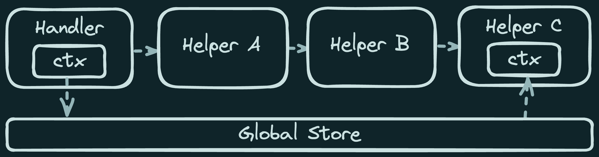

## What is a “context”?


Context refers to information in witch something exists or occurs.
Usually, in web frameworks, it refers to information from the request or shared state, but also can be the general concept of how information is passed arround application components.

The specifics of how context is provided to users is usually different between frameworks, but exploring diferent frameworks, two pattens can be identified: wich I will be refering to as context bucket, and context injection.


## Context Bucket

ADD ANALOGY HERE

Here, the request context if passed directly as a handler **function arguments**, for more functional frameworks, or controller **entity attributes**, for more object oriented ones.
The framework build a context, and passs it as parameters to a user defined function or class.


For example, Express follows the functional approach.
It passes the `req` and `res` objects to the handler, each with their properties and utility methods.
Shared variables are [assigned to the `req` object directly][express-h].
Other frameworks, like [Fastify][fastify-h], [Koa][koa-h] and [Hono][hono-h] follow the same or similar pattern.

[express-h]: https://expressjs.com/en/guide/writing-middleware.html
[fastify-h]: https://fastify.dev/docs/latest/Reference/Hooks/#using-hooks-to-inject-custom-properties
[koa-h]: https://koajs.com#ctx-state
[hono-h]: https://hono.dev/api/context#var

```js
app.use((req, res, next) => {
  res.user = User.find(req.params.id);  // [!code highlight]
  next();
});

app.get("/<id>", (req, res) => {
  res.send(`Hello ${res.user}`)
});
```

Even a batteries-included framework, like [Django][django-h], follows that pattern, getting the `request` as an argument.
On the other side, in Rails, `request` and `response` (and derived objects like `params`) are [passed as  methods][rails-h] to the controller created for the request.

[django-h]: https://docs.djangoproject.com/en/5.0/topics/http/views/
[rails-h]: https://guides.rubyonrails.org/action_controller_overview.html#the-request-and-response-objects

```rb
class SomeController < ApplicationController
  before_action :get_user

  def index
    render plain: "Hello, #{@user.name}"
  end

  private

  def get_user
    @user = User.find(params[:userId])  # [!code highlight]
  end
end
```


---

It's not diferent on the UI component framework land.
A page component behaves as a handler, and the context is passed as props.
But here, some **problems of this type of context passing can be easily seen**.

One of them is **prop (or argument) drilling**, where a component needs to pass down props down multiple layers of components.
The equivalent in a request handler,
would be an utility function deep down the call stack that need information about the request.

```tsx
// [!code word:user]
export default function Page({ user }) {
  return (
    <main>
      <WelcomeMessage to={user.name} />
      <Menu for={user}/>
    </main>
  )
}
```

The page component in the previous example doesn't use the user prop.
But since it's needed somewhere else down `WelcomeMessage` and `Menu`, it needs to be passed down.
The deeper the dependency, the more coupling is created between components.


A second problem arrises because the bucket is shared.
Code interacting with it might endup with **multple unrelated responsabilities**.
For example, frameworks might provide a build step for the bucket, like Vue Options API's [`data`][vue-data], NextJS Pages's [`getServerSideProps`][getServerSideProps], and React Class Components's [`constructor`][react-constructor].

:::note
    In [Vue docs][vue-options], its mentioned that the old Options API provides "guard rails" that guide you to put your code into respective **buckets**. The `data` method could be considered a bucket in that sense.
:::

[vue-options]: https://vuejs.org/guide/extras/composition-api-faq.html#trade-offs


[getServerSideProps]: https://nextjs.org/docs/pages/building-your-application/data-fetching/get-server-side-props
[vue-data]: https://vuejs.org/api/options-state.html#data
[react-constructor]: https://reactjs.org/docs/react-component.html#constructor

```tsx
export async function getStaticProps({ params }) {
  return {
    props: {
      user: User.find(params.userId),
      // ... other unrelated props
    }
  }
}
```

In this case, data is loaded in a single place.
That means, that every component that requires data (like the user) will need to register an apropiate loader in the same function as every other loader. So the `getStaticProps` wil end up been responsible for loading multiple unrelated things.

**Typing arguments** is a derived pain point caused by the shared bucket. When there's prop drilling, the prop should be types for all components in the middle. And when the bucket is shared,
the type is mixed with other unrelated types.


---

The cause of those problems **originates from composition and pipeline patterns** that surge naturally when processing information, specially in more funcitonal programing languages or frameworks.


For example, if a handle function calls A, A calls B, B calls C, and C needs context from A, the context needs to be passed from A to B, and from B to C. In this simple and more direct pipeline, the context is unecessary passed 2 times. In large and more complex pipelines, that number increases by a lot.


```py
# [!code word:req]
def helper_c(req):
  print(f"Hello {req.user.name}")

def helper_b(req):
  return helper_c(req)

def helper_a(req):
  return helper_b(req)

def handler(req):
  req.user = User.find(req.params.userId)
  helper_a(req)
```

Note that **class based frameworks like Rails don't suffer from this as much**. Thats because those can take advantage of class based design patterns and metaprograming. The controller class could extend helpers classes (mixin), so the context would be available to helper C methods without manually passing it.

```rb
module HelperC
  def helper_c
    puts "Hello, #{@user.name}"  # [!code highlight]
  end
end

module HelperB
  include HelperC

  def helper_b
    helper_c
  end
end

module HelperA
  include HelperB

  def helper_a
    helper_b
  end
end

class Controller
  include HelperB

  def initialize
    # Here, the context is added to the class instance # [!code highlight]
    @user = User.find(params[:userId]) # [!code highlight]
  end

  def index
    helper_a
  end
end
```

The code above is more verbose, but assuming the helpers follow an opinated and predictable pattern for the entire application, the end result provides cleaner and more maintainable code thanks to lower coupling.


So the question is: **In functional based frameworks, is it posible to pass a the context arround without the problems mentioned before, and the depeloper experience that class based frameworks might provide?**

## Context Injection

The really stupid and unmaintainable anwser would be to create a global variable and set it before calling the helper functions. It's easy, will not fail in traditional functions, and if it is only used in one place, it's secure enough.

```py
g = SimpleNamespace() # like a dict but with dot access

def helper_c():
  print(f"Hello {g.user.name}") # [!code highlight]

def helper_b():
  return helper_c()

def helper_a():
  return helper_b()

def handler(req):
  # Inyect the context (user) # [!code highlight]
  g.user = User.find(req.params.userId) # [!code highlight]
  helper_a()
  del g.user
```



Somewhere, a function will need to be responsable for setting the context that the request handler will need. Here, it's the `handler` function, and inyects the `user` into a global variable.
The power of this global variables comes into play on **function composition**:

```py {13}
from flask import Flask, request, r

app = Flask(__name__)

def get_user():  # [!code focus]
  "Get the user, memoize it, and return it."  # [!code focus]
  if not g.user:  # [!code focus]
    g.user = User.find(request.view_args["userId"])  # [!code focus]
  return g.user  # [!code focus]

@app.route("/<userId>")
def handle():  # [!code focus]
  user = get_user()  # Just a function call # [!code focus]
  return f"Hello, {user.name}"  # [!code focus]
```

Flask is a mix of both, giving global proxy methods, that provide
a `request` object, `g` for shared state, and other utilities at module level
instead of inside instance attributes or handler arguments ([see Blueprint docs](https://flask.palletsprojects.com/en/3.0.x/tutorial/views/#id5)).


```py
from flask import Flask, request, g

app = Flask(__name__)

@app.before_request
def before_request():
    g.user = User.find(request.view_args["userId"])

@app.route("/<userId>")
def index():
    return f"Hello, {g.user.name}"
```

## Context Injection


## Indirect Context

### Other Examples

#### Dependency Injection - FastAPI

```py
# FastAPI
@app.get("/")
def say_hello(name: str):
    return  {"message": f"Hello, {name}"}
```

#### Dependency Injection - VueJS


### Aditional material and references

- [Stack Overflow: The term “Context” in programing?](https://stackoverflow.com/q/6145091)
