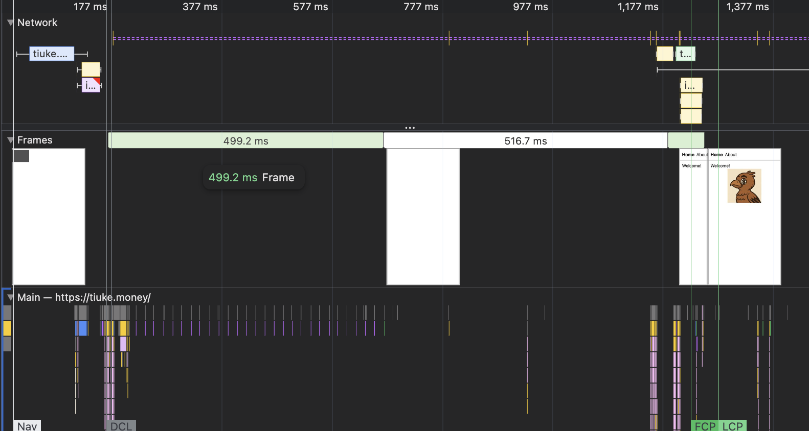

At a hackathon (Platanus Build Night, 25/04/2025), I experimented with Cloudflare Workers new Static Assets feature, that allowed me to build email handling and a static site with the same domain _and_ deployment with ease.

Static Assets allows to, as it name says, have static assets deployed with Workers, to serve complete web apps with all the features of Cloudflare, witch wasn't possible before. It was [relative new (08/04/2025)](http://blog.cloudflare.com/full-stack-development-on-cloudflare-workers/), after a 6 month beta.

This addition improves the support of deployments of popular frameworks, like Next.js with [OpenNext](https://opennext.js.org/cloudflare). Going back to the story,
for the hackathon I used a simple Vite + Tanstack Router app, since I didn't need SSR and queries were to my Convex backend, with the addition of Email Workers.

It went great! The deployment of the app was like 3s for Convex on save, and like 10s for Cloudflare with the deploy command, and that I believe allowed me to complete the app in less than 10 hours. 

But I noted something weird. The app loaded slower than I expected. This static site connected to Convex has loading at about **1.25s**. Convex _might_ be primarily responsible since it's hosted on the US vs the chilean servers of Cloudflare, and I could optimize the startup around that. But _all_ of the 1.25s? It cound't be.

So I checked the performance panel, and saw this:



There it was! Ignoring (for now) the purple line that is the Convex Websocket connection, there are **pesky blocks of JS and CSS** in the network panel, that **take close to 300ms!** This is a capture of a reload with cache enabled (and populated), and made the first paint of the app take more than 1.25s.


To understand the problem, I need a detour to explain about _caching_.

## HTTP Caching

There's _a lot_ that could be talked about caching. Here, I will only outline some patterns that I believe are important to know. While it's about HTTP caching, some might be aplicable to other types of systems caching between 2 components or computers with resources associated with a distinct key.


### Without caching

When the response might change on every request, there is no point in caching.

```http
HTTP/1.1 200 OK
Cache-Control: no-cache
```

It might be surprising at first that responses with that header _are stored_ for future use in a browser! The catch is that it only reuses the response on certain escenarios, like back/forward navigation, and revalidation.

This pattern is most useful for dynamically render resources, like SSR pages and HTTP APIs. 

### Must revalidate

There is no need to download a resource if it hasn't changed.
For that, the response can include when it was `Last-Modified` or an `ETag` hash:

```http
HTTP/1.1 200 OK
Last-Modified: Sat, 11 May 2025 14:30:00 GMT
ETag: "9141fe0d7996ce56448a3d021ce401141e34a9f4"
Cache-Control: max-age=604800, must-revalidate
```

On subsequent requests, the browser will send:

```http
GET /files/post-image.png HTTP/1.1
If-Modified-Since: Sat, 11 May 2025 14:30:00 GMT
If-None-Match: "9141fe0d7996ce56448a3d021ce401141e34a9f4"
```

And if the server can determine that it hasn't changed, it will respond with onl:

```http
HTTP/1.1 304 Not Modified
Cache-Control: max-age=604800, must-revalidate
```

If it was changed, the server returns a `200 OK` response like before.

This pattern allows to cache responses without validation for `max-age` (it revalidates only when stale), and the `must-revalidate` forces the browser to revalidate after it becomes stale. `max-age=0` will revalidate on every request. 

Note that, for [performance reasons](https://blog.chromium.org/2017/01/reload-reloaded-faster-and-leaner-page_26.html), browsers like Chrome will not revalidate secondary resources on page reloads _**unless**_ directives like `no-cache` or `max-age=0, must-revalidate` are used.


Because each resource tracks if it was modified, must revalidate works great for storage buckets, where the contents are static but might change.

### Stale while revalidate

Sometimes, it's ok to serve a stale cache of the resource.
For that, there is `stale-while-revalidate`:

```http
HTTP/1.1 200 OK
Cache-Control: max-age=86400, stale-while-revalidate=2592000
```

That specific response, will use the fresh content for 1 day, and if the resource is stale, it will use the stale content for 30 days while it fetches the new content in the background.

This is really useful combined with the `public` directive, witch allows intermediary servers to cache the resource, like CDNs. This will serve a fast response on stale, while the browser or CDN re-fetches. Note that not every CDN supports `stale-while-revalidate` and some might use it only internally.

With the combination of CDNs request collapsing, in witch multiple requests to the same resource are collapsed into a single request, allows generated content to be served with minimal load to the generator server.


### Immutable

In some cases, the resource never changes, and can be cached for a _long_ time.

```http
HTTP/1.1 200 OK
Cache-Control: public, max-age=31536000, immutable
```

In that response, the resource can be cached for a year, and with `immutable`, that it shouldn't be revalidated for any reason. Because of that, this type of caching can be problematic when applied incorrectly, since after the response has given, there is no way to invalidate it with simple HTTP headers.


To make resources immutable, the resource is usually given an unique key.

```http
GET /assets/main-1a2b3c4d5e6f7g8h9i0j.js HTTP/1.1
```

The key is usually composed with the original name with a hash, a version number, or a timestamp, between the name and the extension.

Since the original resources can change its key, the parent resource must be updated to reference them with the new key. Since this changes the parent, it propagates recursively to ancestors, until it reaches the root, that can be an HTML page or a Web Worker entry file.

```html
<html lang="en">
<head>
  <link rel="stylesheet" href="/assets/main-kf62nsu2ndtp.css" />
  <script src="/assets/main-0dn37dn2ifdg.js"></script>
</head>
<body>
  
</body>
```

Most web frameworks and bundlers like Vite do this automatically, adding a hash to the name, and serving those assets with the `immutable` header. So, for example, you can serve assets from a server, place a CDN in front, and the CDN will cache the resource for a year, decreasing the load of the server.


Immutability allows web pages to behave more like apps. Subsequent loads will be much faster since there isn't a request for immutable resources, not even for revalidation. Also, when the web app is updated, the browser only needs to download changes resources, and not the whole app.

## Back to my static app

If you haven't seen the problem yet, knowing how [Cloudflare Workers Static Assets works](https://developers.cloudflare.com/workers/static-assets/#routing-behavior) might help. It mostly can be boiled down to:

- If the request is for a static asset, return the asset directly. All assets will be served with `public, max-age=0, must-revalidate` and `ETag` by default.
- If not, invoke the Worker (the serverless function). The Worker can return responses with any header, and can get files from static assets.

If you haven't seen it yet, go back to the image of the performance panel: There are multiple requests for assets. The assets are bundled with Vite, so they have a unique key, and the cache was enabled and populated.

The problem is that **immutable assets are served with a revalidation strategy!**

Vite bundles each immutable asset to a specific directory, that is `/assets` by default.
So, to fix this problem, it's needed to create a `_headers` file that adds specific headers to assets served with Cloudflare Workers Static Assets:

```http
/assets/*
    Cache-Control: public, max-age=31536000, immutable
```

Lets look at the performance with the cache populated and the new headers:


From **1250ms to like 900ms**, only with adding the appropriate cache headers!


While Cloudflare Workers has a Vite Plugin, it doesn't add default headers to the build output, so the `_headers` file is needed to be added manually. But there isn't any recommendation about it on the documentation!

Outside of the hackathon, I was using OpenNext to deploy a Next.js app, that it also doesn't generate the `_headers` file! The `next-on-pages` adapter did, but is now considered [deprecated](https://github.com/cloudflare/next-on-pages/issues/952#issuecomment-2713036122). Adding a similar file, changing the `/assets/*` to `/_next/static/*` reduced network calls of the site.


## From the hackathon project to the entire world

Most (if not all) of Cloudflare Workers SDKs and tools are Open Source, and accept contributions.

The simple fix is usually really simple: Adding a `_headers` file, usually inside a `public` directory such that it can be uploaded with all the static assets. It isn't intuitive, since the immutable assets aren't really there, but it works.

I made a contribution to OpenNext, changing the instructions to setup a Next.js project in Cloudflare, to [add that file](https://opennext.js.org/cloudflare/get-started#7-add-static-asset-caching). After the merge, I have already seen a couple of projects adding this fix.

For Vite based frameworks, it's more complicated, since the path to the immutable assets can be modified. 
It could be assumed that it doesn't, and add it to each starting template. But should that file be documented on every template and framework?

My proposal is to [work with the build tool (Vite)](https://github.com/cloudflare/workers-sdk/discussions/9132). Provide primitives like `_headers`, `_redirects` and `_routes.json`, but use build tools with great defaults. That's similar to how [Vercel with its build output API](https://vercel.com/docs/build-output-api) or [Netlify with `netlify.toml`](https://docs.netlify.com/configure-builds/file-based-configuration/) works, providing primitives for frameworks to optimize.

The complete push of the OpenNext fix isn't complete yet (it's missing on some official docs), and the discussion of the proposal is still open at the moment of publishing this post. It will probably take some time, specially in landing how the final API will be and implementing it to the Vite plugin.

## Conclusion

While this side quest took time that I could have used to continue with the project, it not only served me to learn more about HTTP caching, but it also allowed me to improve the performance of a website that I had in production, and to improve the performance not only of my projects on Cloudflare Workers, but also will improve the **user experience by default for all projects** with the fix.

I believe this is the power of open collaboration. If we are able to share solutions to our problems, we all benefit 🚀. And thats even when the companies involved could be considered competitors (see Cloudflare and Netlify on OpenNext).

---

## Bonus: Fixing the issue I had with Convex

The problem was that the entire app has waiting for authentication to be ready before loading the router.

```ts
function App() {
  const authState = useConvexAuth();
  if (authState.isLoading) return null; // Here
  return <RouterProvider router={router} context={{ auth: authState }} />;
}
```

The thing is, that the `useConvexAuth` hook doesn't work well in Tanstack Router (an probably other frameworks), since it's a hook, and frameworks usually expect normal JS functions. What `useConvexAuth` really is, is a Promise in a hook disguise. So I remove the disguise to create a promise:

```ts
export function useAuth() {
  const authState = useConvexAuth();  //                   [v] starts as false
  const [prevLoadingState, setPrevLoadingState] = useState(authState.isLoading);
  const resolvers = useRef(Promise.withResolvers<boolean>());

  if (authState.isLoading !== prevLoadingState) {
    if (authState.isLoading) {
      // isLoading went back to a loading state, reset promise
      resolvers.current = Promise.withResolvers<boolean>();
    } else {
      // Auth is ready, resolve
      resolvers.current.resolve(authState.isAuthenticated);
    }
    setPrevLoadingState(authState.isLoading);
  }

  return {
    waitAuthenticated: () => resolvers.current.promise,
  };
}
```

I can pass that to the framework context, and use it like this to check authentication on only routes that need them:

```ts
const authenticated = await context.auth.waitAuthenticated();
```

The only additional piece thats it's missing, but is irrelevant here, its invalidating the context when the user logs out.
Anyways, here is the final result:


First paint at 170ms from  1250ms. Nice.
