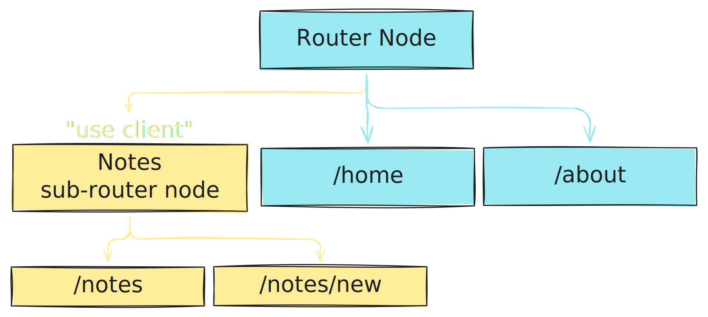

:::note
Update 29-11-2024: I plan to make this a standalone page with more diagrams, separating and writing more consistently and visually the 2 sides of frameworks and the missing pieces related to routing. Also, including better example on the problems that I talked where and in the “bucket” antipattern that I explored previously.
:::

The router is a fundamental part of web applications, or even, al type of software that displays different views based on state.
Specifically for web applications, the router is in charge of deciding which view to show based on the URL.

It might be interpreted as a simple function: `fn(url) -> view`.
Sounds trivial right? Whats the catch?

The way to develop web applications, particularly with React, has evolved significantly, and assumptions that where true before, are not really anymore.

To understand that, we need to start from the beginning.

## Routing in a simple web server

Contents from the HTTP requests are used to decide what to show.
Usually, it's only request HTTP method with the target (URL) from the request-line, but adicional headers like `Host` and `Accept` can be used to.

So any server side web framework like Rails and Django, build conventions and tools to make it easier to define routes and views. The browser navigates to a URL, send a request to the server, and the server responds with the corresponding view.

And it works. In some frameworks event it feels like magic.
But at some point of developing a complex application, this models starts to show it's main disadvantage. Since it is stateless, on every page, the browser has to render and load all the resources again.

Caching helps for static assets, but when views have dynamic content, like analytics or interactive component, it's not enough. Specially when the navigation in the app only changes a small part of the view, requiring a full reload of the page.

There isn't a native way to navigate without loosing state. And apps are have state.

## We need front end frameworks

Front end frameworks are unavoidable when building fast and interactive web applications. There needs to be a mechanism to update views without reloading the entire page.

For example, Hotwire (prev Turbolinks) and HTMX (prev Intercooler) are front end _micro_ frameworks that allow traditional server rendered applications to replace parts of the page without needing to write (much) JavaScript or re-estructure the server side code (much).

The features that those frameworks provide could be implemented with vanilla JavaScript, but a framework standardizes the way to do it so that app developers don't have to maintain it. (Maintaining it also involves keeping the scope of the library limited, witch is harder that it sound).

The existing solutions are great, but have a limitation: it is harder (or more tedious) to include complex dynamic components in the views. Thats why, server side frameworks like Rails and Django, have integrations with javascript component frameworks like React and Vue, allowing developers to build complex components without loosing their favorite server side framework.

In some cases, the server-side frameworks could be decoupled to the views layer.
And since javascript is an static asset and not data, moving it to a specialised server (a CDN) is a good idea.
That ideas where the start of the [JAMStack architecture](https://jamstack.org/), that started with single page applications (SPA).

So, client side based routing was born.

## The scape to fully client side routing

Client side applications like SPAs implement their own routing mechanism in the browser.
That means that the browser doesn't need to make a request to the server to get the view,
instead, the client side applications knows what to show and only needs to fetch the data.
This simple architecture has limitations, mainly 2: performance and SEO.

In the performance side, the naive initial implementation of SPAs was to load all the resources at the start. This might be fine for small applications, but as the application grows, the initial load time grows too. So the solution was to lazy load components from the application.

This stills requires the entire router to be loaded at the start, but heavy components can be loaded only when needed. RemixJS implements a [lazy route discovery mechanism](https://remix.run/docs/en/main/guides/lazy-route-discovery#lazy-route-discovery-aka-fog-of-war) to avoid loading the entire router at the start, but comes with the cost of an additional request to the server (that is eagerly loaded).

The seconds problem is search engine optimization (SEO). Since the router is fully client side, the initial HTML that the server sends to the browser is empty, and internet bots like Google's crawler can't see the content of the page. To solve that problem, server side rendering (SSR) was implemented for component frameworks.

SSR takes the code of the view and renders a HTML string that is sent to the browser. This introduces more complexity on the framework:

- Since the view is rendered on the server, **the server has to include the JS code that the view needs to run**. For simple components that ok, but when pre-rendering a complex component, for example, a visualization that uses D3, the server has to include the entire D3 library. Also, ot might be expensive to run client side code on the server. Making the component and it's dependencies client side only is a solution, but might not be ergonomic on some frameworks.
- Also since the view is rendered on the server, **the component should work both in the server and client**. This isn't a problem on simple components, but is problematic when an app grows. Data loading might be extracted on a bucket function like `getServerSideProps` on NextJS or `loadData` on RemixJS to solve this (I strongly believe that that is an antipattern). And `window` checks can be used to run code that is only available on the client. Both and more workarounds are _hacks_ required for this type of SSR. In frameworks, this brings a lot of inconsistencies.
- And when the code arribes to the client, **the client has to hidrate the view**, adding interactivity to the previously static HTML. This is usually a task of the framework, and the app developer doesn't have to worry about it.

## Back to the server with React

React Server Components (RSC) is a new layer of the React component framework that allows to render components only on the server. Instead of using assuming that the view is client side only, RSC embraces the server side render flexibility that frameworks like Rails and Django have. It isn't a framework for business logic, so it doesn't feel that magical, but allows patterns that where harder to implement.

For example, lets say that we are building a dashboard that displays additional sections depending of the permissions of a given user. With RSC, this can be implemented like this:

```tsx
type Section = {
	Icon: React.ComponentType;
	name: string;
	route: string;
	component: React.ComponentType;
};

async function Dashboard() {
	const permissions = await getPermissionsOfCurrentUser();
	const sections: Array<Sections> = [HomeSection, SettingsSection];
	if (permissions.includes("admin")) sections.push(AuditSection);
	return <InteractiveDashboard sections={sections} />;
}
```

This would load the admin section to the client only if the user has the admin permission,
while still providing a interactive experience to the user with the InteractiveDashboard client component.
`getPermissionsOfCurrentUser` could be a query directly to the database, since the code only runs on the server.

RSC allows incredible patterns for complex web applications that render static components.
For example, sites that renders entire static pages from data (like with CMS) could render the layout on the server to be passed to the client, instead of providing the entire page rendering logic and the entire CMS query data to the client (if not careful, witch in really happens a **lot**).

Also, using RSC makes the loader waterfall problem insignificant. Each page could be entirely rendered on the server, so each roundtrip is to the database, and not from the server to the client. This also allows loading composition patterns that aren't possible with client only loading, where data loading can only be done per route.

## Where we are

- NextJS App dir is the only framework that _works great_ with RSC. There are experimental implementations like [Waku](https://github.com/dai-shi/waku). The React team hasn't provided stables APIs to work with RSC, so the advances of RSC are limited to NextJS.
- React Router and TanStack Router are _really great_ for apps that need to be more client side. They try to solve the problems of SSR with RemixJS and TanStack Start, but are still limited on the inconsistencies and hacks that SSR brings.


NextJS App dir provides a server routing mechanism thanks to RSC, but when a part of the application requires some sort of fully client side routing, in NextJs [we are left with primitive methods like from `window.history` to avoid reloading the page](https://nextjs.org/docs/app/building-your-application/routing/linking-and-navigating#using-the-native-history-api). Thats not great for a modern frontend framework.

Note that the problems of client side routers arise when more hybrid components are used, and when the client need to known before hand code to navigate to the next page.

Does the flexibility of RSC can be used to solve this problems?


## The missing piece

What if we treat the router tree just like a [component tree with "use client"](https://react.dev/reference/rsc/use-client#how-use-client-marks-client-code)?

This is nothing new, React Router has done this for a while. But lets introduce the same idea of the separation of client vs server that RSC has.



Imagine that if the blue nodes are handled like NextJS App dir, and when a "use client" directive is found on the router, a fully client side router like TanStack Router takes over navigation.

In reality, NextJS implements a “client side” routing, but it doesn't have the primitives of a traditional client side router. So, how we could add this routing primitives to a mode server based router like NextJS?

Going to the basics, routing is going from one view to another. So, let's asume that we are in a route and see the required steps.

- From `/home` to `/about`: We would ask the server for the nodes that are in the path to `/about` relative to `/home`. The client side does not know the complete routing tree, so the client sends the _from_ and _to_ to the server. The server responds with the nodes that are in the path to `/about` relative to `/home`, fully rendered with RSC.
- From `/about` to `/notes`: The same as before, but the entire tree of the `notes` router is sent to the client.
- From `/notes` to `/notes/new`: Since the route is included on the tree `notes`, the navigation is fully client side.
- From `/notes/new` to `/home`: The `/home` route could be cached on the client, so it does not require another request to the server.

That seems great, but how would that implemented at a framework level?
There must be a mechanism to change the route behavior depending on the client or server,
loading to cache the routes in the client, and rendering only the matched route on the server.

```tsx
// router-library.server.ts
export function Route({ component: Component, path }) {
	// Get the current path from a server side api, like async local storage
	const currentPath = getCurrentPath();
	if (routeMatches(currentPath, path)) {
		// Missing here: wrapping the RSC in a client
		// component so it can be cached on the client
		return <Component />;
	}
	return null;
}

// router-library.client.ts
export function Route({ component: Component, path }) {
	// Asume that we have a router context
	const { currentRoute } = useRouteContext();
	if (routeMatches(currentRoute, path)) return <Component />;
	return null;
}

// my-router.ts
import { Route } from "router-library";
import { Home } from "./home"; // RSC
import { About } from "./about"; // RSC
import { Notes } from "./notes"; // Client component

export function RouteNode({ routeTree }) {
	return (
		<>
			<Route path="/home" component={Home} />
			<Route path="/about" component={About} />
			<Route path="/notes" component={Notes} />
		</>
	);
}

// notes.ts
("use client");

import { Route } from "router-library";

export function Notes() {
	return (
		<>
			<Route path="/notes" component={NotesList} />
			<Route path="/notes/new" component={NewNote} />
		</>
	);
}
```

Some notes of whats is missing on this example:

- **Caching**. Router nodes might be wrapped on a client component that caches them. One could use a `Map` to cache every component that is part of the router tree. A fancier abroach could use TanStack Query to query, cache and invalidate the components on mutation.
- **How to handle navigation**. If the requested component is not in the cache, a RSC query should be made to the server, providing the `from` and `to` paths to avoid rendering the entire tree.
  The server should responde somehow with only the components that are needed.

  To insert the response, the client router should have an idea of **where** to insert (or replace) the new nodes on the React tree. The client router would have a incomplete route to a path, for example, it could have the (`/some`) -> (`/path`) route tree and want's to navigate to `/some/path/to/go`. The client should request everything from the (`/path`) node to the `/some/path/to/go` route, resulting on the (`/to`) -> (`/go`) route tree returned on the server, witch should inserted on the (`path`) node.

Implementing this is out of scope of this post, and would require implementing and experimenting with more complex APIs. Right now (React 19.x), the implementation APIs for RSC are not stable, and is hard to try them out. I tried to start some experiments, but ended unsuccessful.

## Final thoughts

React Server Components will have a second breakthrough when a modern router is implemented.
NextJS App dir is great for server based routing, but when client side navigation is required (from client only navigation to search params), it lacks the primitives to do it in a "React way". React Router and TanStack Router are great for client side routing and provide great DX, but SSR introduces problems that are imposible to solve without relaying on server only rendering.

Separating backend and client routing might allow great patterns that where weird to implement before. Like intercepting navigation with mounted client side routes that would otherwise go to the server. Or having a component on a layout change easily depending on the current route (NextJS parallel routes, but client side).

So now, we wait.
Great APIs come with time, and strongly believe that the future of React is bright.

:::note
The NextJS team [has plans on implementing something like this](https://x.com/feedthejim/status/1842446297841778840).
:::

:::note
I am skipping some frameworks like Marko and Qwik, that have novel ideas on framework architecture. I haven't studied them enough to include them in detail, but for what I understand, Marko haves an incredible (specially for its time) architecture for server side rendering, but lacks great client side primitives. Qwik changes how JS is delivered, but looking at the loader pattern, it's routing and loader architecture is similar to other JamStack frameworks.
:::
